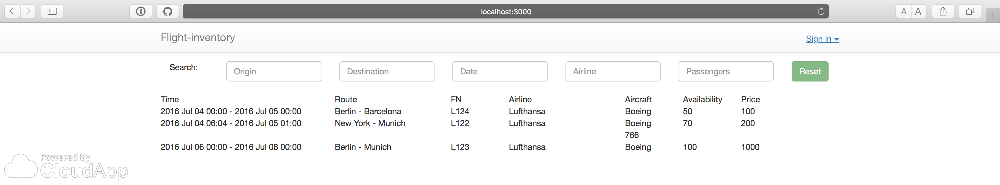

# Flight Inventory

Solution based on meteor platform. It's required to have meteor installed in the system before starting installation process. How to install meteor [here](https://www.meteor.com/install)

## Installation

* download source of the project
* unarchive it
* go to the project directory
* run `meteor npm install`
* run `meteor`
* open `http://localhost:3000` in browser

## Creating users with different roles:

Application supports 2 type of roles: `users` and `managers`. You shoud give `managers` role using terminal console:

* create account in user facing interface in brower;
* go to the project directory 
* run `meteor shell`
* run command in shell `Roles.addUsersToRoles(Accounts.users.findOne()._id, 'managers', Roles.GLOBAL_GROUP);` - now this account has manager perms

## Screeenshots

Anonym interface:

User able to see the flights and search over them.

User interface:

User able to see the flights, search and book them.

Manager interface:

User able to see the flights, search them and make CRUD operations using flight form.

Tests coverage:

